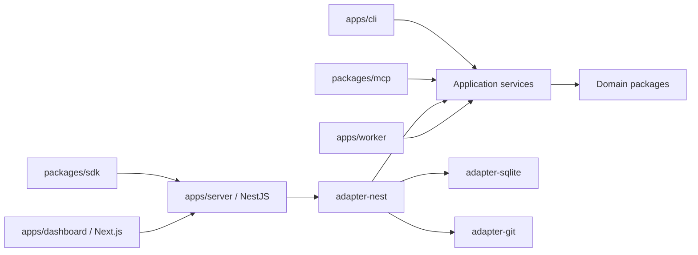
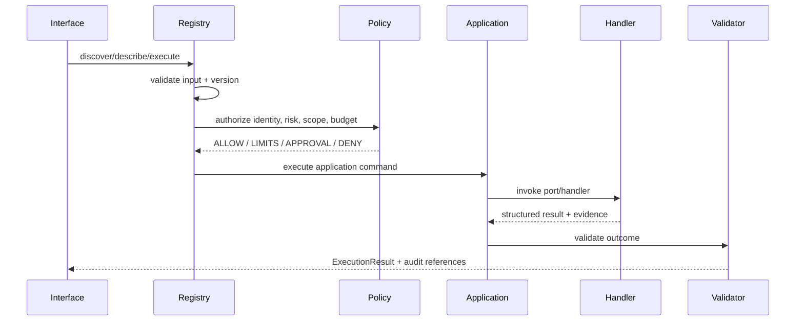
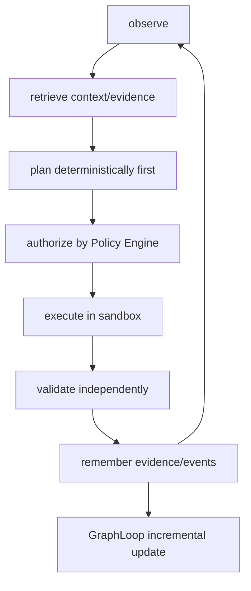
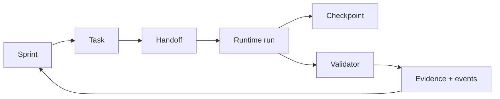

# ForjaJS 2.0 — Arquitetura de referência

## Direção de dependência

```text
interfaces externas (CLI, REST/SSE, MCP, SDK, dashboard)
                 ↓
adapters (Nest, SQLite, Git, transporte, filesystem)
                 ↓
application layer (casos de uso, comandos, queries, políticas)
                 ↓
domain core (contratos, invariantes, estados, eventos)
```

`packages/core`, `contracts`, `policy`, `runtime`, `graph`, `context`, `planner`, `validator`,
`orchestration` e `events` não importam NestJS, Next.js, Express, Fastify, React ou drivers de
persistência. Portas são interfaces TypeScript; adapters fazem o binding.

## Containers



## Componentes e persistência

SQLite é a persistência local padrão para memória, eventos, runs, handoffs e checkpoints.
Filesystem e Git worktree são usados para artefatos e sandbox. Cada porta de persistência deve
permitir uma implementação substituível; nenhuma entidade conhece SQL.

## Capability e execução



## Autonomia e GraphLoop



GraphLoop mantém nós, arestas, evidências, validade temporal e status (`verified`, `inferred`,
`hypothesis`, `contradicted`, `unknown`). CodeGraph continua sendo a análise de código do 1.x;
GraphLoop pode consumir seus resultados, mas não o substitui.

## Processos e falhas

O modo padrão é processo separado para worker e server, com SQLite local e jobs persistidos.
Execuções curtas podem ser síncronas; tarefas longas usam scheduler/worker e checkpoint. REST +
SSE são a interface oficial inicial. WebSocket fica adiado até existir requisito verificável.
Retries têm limite e chave idempotente; eventos têm log append-only, consumer offsets e dead
letter. Cancelamento e retomada são estados explícitos.

## Fluxos de domínio



Dashboard exibe e solicita comandos; não contém regras de autorização, GraphLoop ou execução.
Plugins só recebem capabilities e eventos declarados em manifesto permissionado.

## Migração e empacotamento

O repositório atual permanece publicável como 1.x enquanto `apps/` e `packages/` são introduzidos
de forma aditiva. A CLI existente roteia para o novo núcleo por capability quando houver
equivalente; comandos sem equivalente continuam no caminho legado. Migrações criam backup,
validam antes de promover e não removem dados por padrão.
