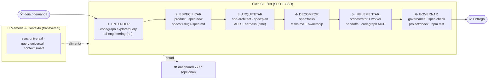

# Fluxo do 2-projeto-agents — mapa operacional

**Princípio:** CLI-first. Todo o ciclo roda por linha de comando. O dashboard web
(`npm run dashboard`, porta 7777) é **visão opcional read-only** — nunca é gate de
spec, handoff, sprint ou entrega.

As 3 capacidades externas (ADR-0016) entram em pontos específicos do ciclo, sem mudar
o pipeline SDD+GSD existente:

- **codegraph** (MCP/CLI) → entender o código e medir impacto.
- **harness** (plugin) → desenhar o time de agentes de uma feature/domínio.
- **ai-engineering** (referência) → fundamentar decisões técnicas de IA.

---

## Mapa do ciclo



### Fallback ASCII (sem render)

```
        ┌──────────── 🧠 MEMÓRIA & CONTEXTO (transversal) ────────────┐
        │   sync:universal  ·  query:universal  ·  context:smart       │
        └──────────────────────────────┬──────────────────────────────┘
                                        ↓ alimenta
 💡 ─► 1·ENTENDER ─► 2·ESPECIFICAR ─► 3·ARQUITETAR ─► 4·DECOMPOR ─► 5·IMPLEMENTAR ─► 6·GOVERNAR ─► ✅
        codegraph       product          sdd-arch          tasks         worker          governance
        ai-eng (ref)    spec:new         spec:plan+ADR     spec:tasks    codegraph MCP   spec:check
                                         harness (time)                  handoffs        project:check
                                        ──────────────► 👁 dashboard 7777 (opcional, read-only)
```

---

## Etapa → papel → comando → capacidade

| # | Etapa | Papel | Comando(s) CLI | Capacidade usada |
|---|-------|-------|----------------|------------------|
| 1 | Entender | context-engineer | `codegraph explore "<área>"` · `npm run code:query "<x>"` · `npm run context:smart` | **codegraph** · **ai-engineering** |
| 2 | Especificar | product | `npm run spec:new -- <slug>` | — |
| 3 | Arquitetar | sdd-architect | `npm run spec:plan -- <slug>` · ADR em `memory/90-decisions/` | **harness** (desenhar time) |
| 4 | Decompor | sdd-architect | `npm run spec:tasks -- <slug>` | — |
| 5 | Implementar | orchestrator + worker | `npm run gsd:handoff -- implement <slug>` · MCP `codegraph_explore`/`codegraph_node` | **codegraph** |
| 6 | Governar | governance | `npm run spec:check -- <slug>` · `npm test` · `npm run project:check` · `codegraph affected` | **codegraph** (impacto) |

Handoffs entre papéis: `npm run gsd:handoff -- <intent> <slug>` (7 campos, ADR-0005),
gravados na tabela `handoffs` do `~/forja-workspace/memory/sqlite/universal.db` (ADR-0008).

---

## Onde cada capacidade entra (estratégico)

**codegraph — análise de código.** Use *antes* de mexer (etapa 1) para mapear símbolos
e call paths sem ler arquivo por arquivo, e *durante* a implementação (etapa 5) via
ferramentas MCP. Na governança (etapa 6), `codegraph affected <arquivos>` mostra os
testes impactados por uma mudança. Mantenha o índice fresco com `npm run code:sync`.

**harness — orquestração.** Quando uma feature/domínio nova precisa de um time de agentes
próprio, na etapa 3 peça _"build a harness for this project"_ numa sessão Claude Code:
ele escolhe um dos 6 padrões e gera `.claude/agents/` + `.claude/skills/`. O framework
então *opera* esses agentes pelos handoffs existentes — harness desenha, GSD executa.

**ai-engineering — base de conhecimento.** Referência para decisões técnicas de IA
(etapa 1 e ao escrever ADRs na etapa 3). Consulte `projects/ai-engineering-from-scratch-main/`
(`ROADMAP.md`, `phases/`, `glossary/`).

---

## Front (opcional)

O dashboard sobe com `npm run dashboard` em `http://127.0.0.1:7777` e oferece uma visão
read-only de specs, handoffs e agentes (`/api/health`, `/api/specs`, `/api/handoffs`,
`/api/agents`). É conveniência de leitura — se não subir, **o fluxo segue 100% pela CLI**.

Ver também: `docs/cli-first-operacao.md` (comandos), `docs/capacidades-externas.md`
(detalhe das 3 capacidades), `AGENTS.md` (papéis), ADR-0016.
