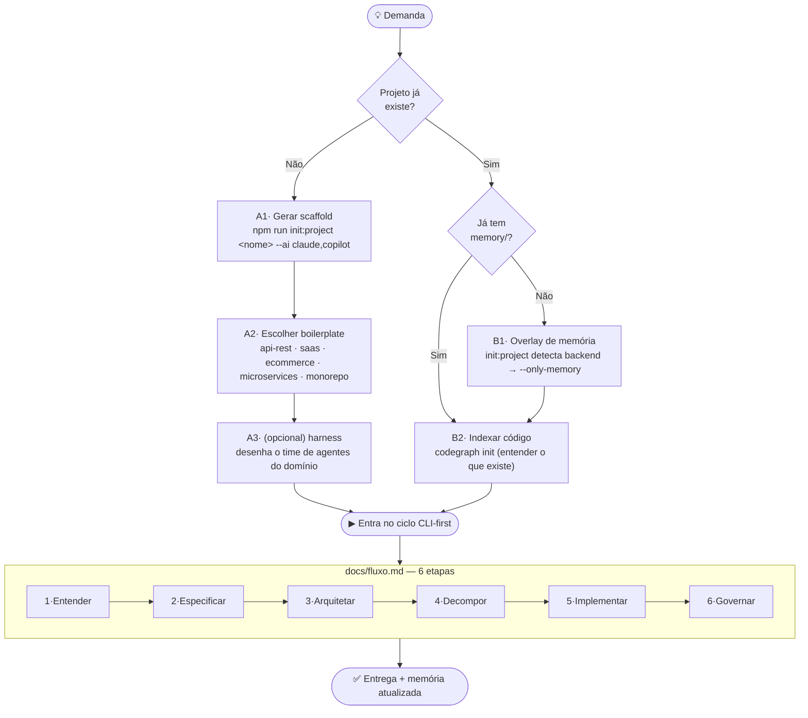

# Processo de projeto com a IA — criar ou atualizar

Mapa de **nível 0**: como a demanda entra no framework e vira trabalho. Decide entre
**criar** um projeto novo e **atualizar** um existente; ambos convergem no ciclo
CLI-first de 6 etapas detalhado em [`docs/fluxo.md`](./fluxo.md).

> "Nossa IA" = os 6 papéis (`AGENTS.md`) operando via Claude Code, apoiados pelas 3
> capacidades do [ADR-0016](../memory/90-decisions/0016-integracao-capacidades-externas.md):
> **codegraph** (entender código), **harness** (desenhar time), **ai-engineering** (referência).

---

## Mapa de decisão



### Fallback ASCII

```
💡 Demanda
   │
   ├─ projeto NÃO existe ─► A1 init:project <nome> --ai …
   │                        A2 escolher boilerplate
   │                        A3 (opc.) harness desenha o time ─┐
   │                                                          │
   └─ projeto JÁ existe ──► tem memory/?                      │
                            ├─ não ► B1 overlay --only-memory │
                            └─ sim ─┘                         │
                                    B2 codegraph init ────────┤
                                                              ▼
                              ▶ CICLO (docs/fluxo.md):
                              1·Entender → 2·Especificar → 3·Arquitetar
                              → 4·Decompor → 5·Implementar → 6·Governar ─► ✅
```

---

## Ramo A — Criar projeto novo

O gerador (`bin/init-project.js`) roda 8 passos: git-init → estrutura agentes+memória
→ design-lib → instruções multi-IA → install-backend → init memória SQLite →
context-pack → next-steps. Cada projeto nasce com `memory/`, `.ia-instructions/`
(claude/copilot/gemini/codex) e seu próprio banco de memória.

Projetos de produto vivem no **workspace Forja** (`~/forja-workspace/projects/<nome>`
por padrão), fora do repo do framework. Veja ADR-0019.

```bash
# 1. preparar workspace (uma vez)
npm run workspace:init

# 2. gerar (cria em ~/forja-workspace/projects/<nome>)
npm run project:new <nome> -- --ai claude,copilot,gemini

# 3. (opcional) escolher boilerplate de stack
ls boilerplates/        # 01-api-rest · 02-saas-starter · 03-ecommerce · 04-microservices · 05-monorepo

# 4. (opcional) na sessão Claude Code, desenhar o time de agentes do domínio:
#    "build a harness for this project"   → gera .claude/agents + .claude/skills

# 5. entrar no ciclo: começa pela spec
npm run spec:new -- <slug>
```

---

## Ramo B — Atualizar projeto existente

```bash
# B1. projeto sem memória ainda? sobrepõe só a camada de memória/agentes
#     (init:project detecta backend e aplica --only-memory automaticamente)
npm run init:project <nome>        # apontando para o projeto existente

# B2. indexar o código atual ANTES de mexer (entender sem ler arquivo a arquivo)
codegraph init                     # ou: npm run code:index
codegraph explore "<área a mudar>"

# entra no ciclo pela spec da mudança
npm run spec:new -- <slug>
```

A diferença essencial do ramo B é a **etapa 1 (Entender) com codegraph**: antes de
especificar a mudança, mapeie símbolos, callers e impacto no código que já existe.

---

## Convergência — o ciclo (resumo)

Os dois ramos terminam no mesmo ciclo de 6 etapas. Quem dirige cada uma:

| # | Etapa | Papel | Capacidade |
|---|-------|-------|------------|
| 1 | Entender | context-engineer | codegraph · ai-engineering |
| 2 | Especificar | product | — |
| 3 | Arquitetar | sdd-architect | harness · ADR |
| 4 | Decompor | sdd-architect | — |
| 5 | Implementar | orchestrator + worker | codegraph (MCP) |
| 6 | Governar | governance | codegraph (`affected`) |

Detalhe de comandos por etapa, handoffs (7 campos, ADR-0005) e o papel do dashboard
opcional: **[`docs/fluxo.md`](./fluxo.md)**.

---

## Onde "nossa IA" age em cada ramo

- **Novo projeto:** a IA gera o scaffold, e o **harness** desenha o time de agentes
  inicial sob medida para o domínio. ai-engineering fundamenta escolhas técnicas.
- **Projeto existente:** **codegraph** dá à IA o mapa do código atual (símbolos,
  call paths, testes afetados) — é o que evita refator às cegas. O overlay
  `--only-memory` dá ao projeto a camada de memória/agentes sem tocar no código.
- **Sempre:** memória e contexto são transversais (`sync:universal`,
  `query:universal`, `context:smart`) e cada handoff entre papéis fica registrado em
  `~/forja-workspace/memory/sqlite/universal.db`.
